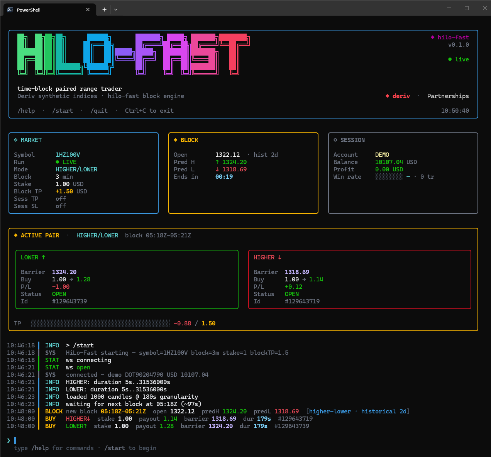
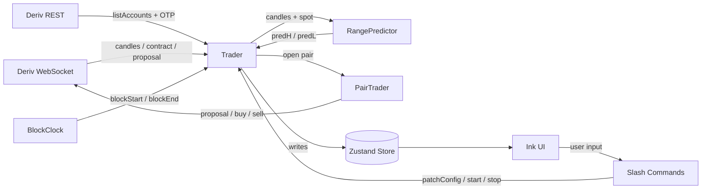
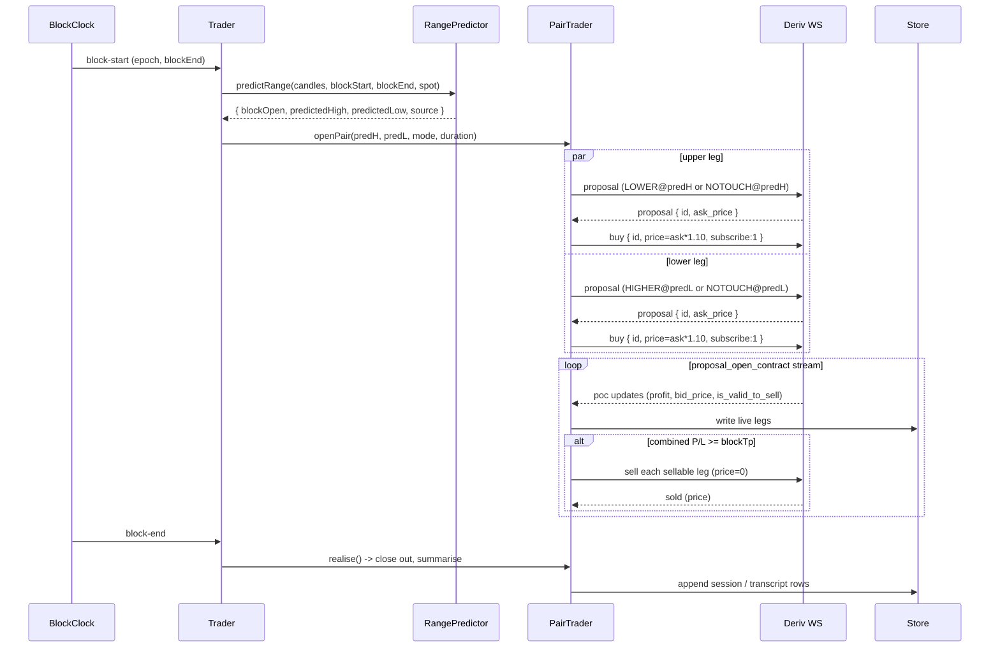
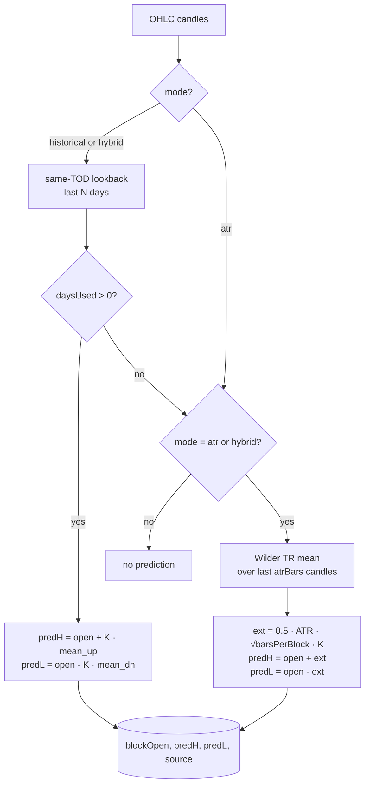

<div align="center">

# hilo-fast

**Time-block paired auto trading CLI for Deriv synthetic indices.**

A Bun + Ink (React in terminal) REPL that streams candles over WebSocket, computes a non repainting predicted high and predicted low for every N minute block, opens two stay-in-range Deriv contracts at every fresh block boundary, and closes the pair early when the combined live profit hits a per-block target.


<br/>



</div>

---

## Why this exists

Deriv synthetic indices spend most of their time inside a statistically tight intraday band, but generic indicators chase those bands continuously and repaint when reality disagrees. `hilo-fast` is the opposite shape:

1. **One prediction, locked.** The predicted high and low are computed once at block start and never change inside the block. No repaint.
2. **Pair the bet, take the bias out.** Both legs are stay-in-range. They cover the same `[predL, predH]` interval from opposite barriers, so the pair pays whenever price respects the predicted band.
3. **Close on combined profit, not on either leg.** The pair is sold the moment summed live P/L hits the block take-profit. Asymmetric outcomes are still net positive when one leg drifts faster than the other.
4. **Block aligned to wall clock.** Blocks are anchored to UTC 00:00. The contract duration is exactly the remaining block, so the bet resolves on the same boundary the next prediction is drawn from.
5. **Fast iteration in the terminal.** Ink + slash command REPL gives the same ergonomics as Claude Code. `/start`, watch, tweak, `/stop`.

The project is a research tool, not a guaranteed strategy. It exists to make short horizon block bets cheap to run and reason about.

---

## Features

- **Non repainting block prediction** with three sources: same-time-of-day historical, ATR fallback, hybrid
- **Two stay-in-range modes**: `higher-lower` (exit-spot only) and `no-touch` (any intrabar touch loses)
- **One pair per block**, opened in parallel via `Promise.allSettled`
- **Block take profit**: closes both legs the instant combined live P/L crosses the threshold
- **Optional session take profit and session stop loss** as global halt guards
- **Slash command REPL** with autocomplete and nested selection menus
- **Hot-swap soft config** (`stake`, `blockTp`, `sessionTp`, `sessionSl`) without restarting
- **Hard config auto-stop** so any mode/symbol/block change re-validates against `contracts_for`
- **Pre-flight contract guard** verifies the symbol supports the active mode and reads per-contract-type duration bounds
- **Session rollover** transparently refreshes the Deriv OTP before the 1h cap
- **Reactive reconnect** with exponential backoff on unexpected drops
- **Dry run** drives synthetic candles and simulates buys/sells with zero exposure

---

## Architecture

Data flows strictly one way. The UI never talks to the WebSocket, it only subscribes to Zustand state.



**Key piece responsibilities:**

| Module | Role |
| --- | --- |
| `services/derivRest.ts` | `listAccounts`, `getOtpUrl`, account picking with `HILO_PREFER`. |
| `services/derivWS/client.ts` | Single WS client. Session rollover, reconnect, `proposal` then `buy`, candles, `contracts_for`. |
| `engine/blockClock.ts` | UTC midnight aligned block emitter. Fires `block-start` and `block-end`. |
| `engine/rangePredictor.ts` | Pure function `candles -> { blockOpen, predictedHigh, predictedLow, source }`. |
| `trading/trader.ts` | Orchestrator. Connect, candles, blockClock, lifecycle, soft vs hard config. |
| `trading/pairTrader.ts` | Owns the current block's pair. Opens both legs, drives TP-based sell, mode dispatch. |
| `state/store.ts` | Source of truth for config, status, account, current pair, session, transcript, menu stack. |

---

## Trade modes

Both modes are stay-in-range bets. They differ only in path sensitivity.

| Mode | Upper leg | Lower leg | Resolution | Profile |
| --- | --- | --- | --- | --- |
| `higher-lower` (default) | `LOWER @ predH` | `HIGHER @ predL` | Exit spot only. Intrabar breaches that mean revert are fine. | Lower payout, higher win rate. |
| `no-touch` | `NOTOUCH @ predH` | `NOTOUCH @ predL` | Any intrabar touch loses that leg. | Higher payout, lower win rate. |

> **Leg label convention.** Transcript and panel labels carry an arrow: `↑` is the upper (predH) leg, `↓` is the lower (predL) leg. The text before the arrow is the actual Deriv contract type. Example pair under `higher-lower`: `LOWER↑` and `HIGHER↓`.

**Barrier sanity:**

- The upper leg is skipped if `predictedHigh <= spot`.
- The lower leg is skipped if `predictedLow >= spot`.
- A barrier on the wrong side of spot is not a meaningful bet, regardless of mode.

**Duration unit:**

- `HIGHER` and `LOWER` are submitted in **seconds**. Full block-end resolution works.
- `NOTOUCH` is submitted in **minutes**. Synthetics only offer minute resolution for NOTOUCH even though `contracts_for` reports a wider range. Submitting seconds returns `Trading is not offered for this duration`.

---

## Block lifecycle



**Trade gate:** a pair is opened only when all of:

```text
trader.running
AND not paused for session-tp / session-sl
AND no live pair from the previous block
AND duration in [contractMinDuration, contractMaxDuration]
AND current spot is on the right side of each barrier
```

`Trader.start()` does not fire `onBlockStart` for the in-progress block. It waits for the next UTC aligned boundary so the contract duration matches the block exactly and the prediction is fresh.

---

## Range prediction

`engine/rangePredictor.ts` is a pure port of a TimeBlocks MT5 indicator.



**Historical model** (preferred when at least one same-TOD day is found):

```text
for each of the last N days at the same time-of-day window:
  sum_up += max(high) - first.open
  sum_dn += first.open - min(low)
mean_up = sum_up / days_used
mean_dn = sum_dn / days_used
predH = blockOpen + K · mean_up
predL = blockOpen - K · mean_dn
```

**ATR fallback** (Parkinson / Brownian extreme scaling):

```text
atr = Wilder TR mean over last atrBars candles strictly before blockStart
ext = 0.5 · atr · sqrt(barsPerBlock) · K
predH = blockOpen + ext
predL = blockOpen - ext
```

When the candle feed is at block-size granularity (`barsPerBlock = 1`), the ATR term simplifies to `0.5 · atr · K`.

**Range modes:**

| Mode | Behaviour |
| --- | --- |
| `historical` | Historical only. Returns `null` if no same-TOD days were found. |
| `atr` | ATR only. Skips the historical pass. |
| `hybrid` (default) | Historical when available, ATR fallback otherwise. |

> **Granularity rule.** Deriv only accepts a fixed set of candle granularities: `60, 120, 180, 300, 600, 900, 1800, 3600, 7200, 14400, 28800, 86400` seconds. `--block-minutes` is multiplied by 60 and must match one of these.

---

## Quick start

### Prerequisites

- [Bun](https://bun.sh) 1.1+
- A Deriv Personal Access Token with scopes: `Read`, `Trade`, `Trading Information`, `Payments`. Create one at <https://app.deriv.com/account/api-token>.

### Install

```bash
git clone https://github.com/dinethlive/hilo-fast.git
cd hilo-fast
bun install
cp .env.example .env
# edit .env, set DERIV_TOKEN=...
```

### Run

```bash
bun run start                                      # opens the REPL, nothing is traded yet
bun run start -- --dry-run                          # synthetic candles, simulated trades
bun run start -- --symbol 1HZ100V --block-minutes 3 --block-tp 1.5
bun run start -- --mode no-touch --range-mode hybrid
```

The REPL opens immediately. Run `/start` to connect, verify `contracts_for`, wait for the next UTC aligned block boundary, and begin trading. Run `/stop` or `Ctrl+C` to shut down gracefully.

### Build a standalone Windows exe

```bash
bun run build        # outputs dist/hilo-fast.exe
```

---

## Configuration

Every knob has an env var, a CLI flag, and for live values a slash command. Precedence: `flag > env > default`.

| Concern | Env var | Flag | Slash | Default |
| --- | --- | --- | --- | --- |
| Deriv PAT | `DERIV_TOKEN` | `--token` | n/a | required for `/start` |
| App ID | `DERIV_APP_ID` | `--app-id` | n/a | bundled |
| Account ID | `DERIV_ACCOUNT_ID` | `--account-id` | n/a | first active demo |
| Account preference | `HILO_PREFER` | `--prefer` | n/a | `demo` |
| Symbol | `HILO_SYMBOL` | `--symbol` | `/symbol` | `1HZ100V` |
| Stake (per leg) | `HILO_STAKE` | `--stake` | `/stake` | `1.0` |
| Currency | `HILO_CURRENCY` | `--currency` | n/a | account currency |
| Block size (min) | `HILO_BLOCK_MINUTES` | `--block-minutes` | `/block` | `3` |
| Block take profit | `HILO_BLOCK_TP` | `--block-tp` | `/block-tp` | `1.5` |
| Session take profit | `HILO_SESSION_TP` | `--session-tp` | `/session-tp` | off |
| Session stop loss | `HILO_SESSION_SL` | `--session-sl` | `/session-sl` | off |
| Trade primitive | `HILO_TRADE_MODE` | `--mode` | `/mode` | `higher-lower` |
| Range mode | `HILO_RANGE_MODE` | `--range-mode` | `/range-mode` | `hybrid` |
| Lookback days | `HILO_LOOKBACK_DAYS` | `--lookback-days` | n/a | `20` |
| ATR window | `HILO_ATR_BARS` | `--atr-bars` | n/a | `14` |
| Range multiplier | `HILO_RANGE_K` | `--range-k` | n/a | `1.0` |

> **Two decimals.** Deriv caps `price` and `amount` at 2 decimal places server side. Values are rounded before `proposal`.

---

## Soft vs hard config

The Trader splits config into two groups so hot-swaps never silently invalidate the active pair.

| Group | Fields | Behaviour on change |
| --- | --- | --- |
| **Soft** | `stake`, `blockTp`, `sessionTp`, `sessionSl`, `currency` | Hot-swap. The current block keeps its open pair; the new value applies from the next block (or immediately for `blockTp` against the live pair). |
| **Hard** | `mode`, `rangeMode`, `symbol`, `blockMinutes`, `lookbackDays`, `atrBars`, `rangeK`, `appId`, `token`, `accountId` | Auto-stops the bot. The user must `/start` to re-validate `contracts_for` and align to a fresh block. |

`commands.ts::patchCfg` routes through `Trader.patchConfig` when a Trader exists, or writes the store directly when idle. One `setConfig` call per patch, so the store notifies subscribers exactly once.

---

## Slash commands

Typed into the REPL. `/` triggers the autocomplete menu. `Tab` completes, `Enter` submits, `Esc` clears.

### Lifecycle

| Command | Aliases | Effect |
| --- | --- | --- |
| `/start` | | Connect, verify, wait for next UTC aligned block, begin trading. |
| `/stop` | `/halt` | Sell sellable legs, tear down the WS, prepare a fresh Trader for the next `/start`. |
| `/quit` | `/exit`, `/q` | Leave the program. |

### Soft config (hot-swap)

| Command | Aliases | Effect |
| --- | --- | --- |
| `/block-tp <usd>` | `/tp`, `/btp` | Close-pair threshold on combined live P/L. |
| `/session-tp <usd\|off>` | `/stp` | Halt session at this profit. `off` to disable. |
| `/session-sl <usd\|off>` | `/ssl` | Halt session at this loss. `off` to disable. |
| `/stake <usd>` | | Per-leg stake, applies from the next block. |

### Hard config (auto-stops the bot)

| Command | Aliases | Effect |
| --- | --- | --- |
| `/mode [higher-lower\|no-touch]` | | No args opens a numbered menu. |
| `/range-mode [hybrid\|historical\|atr]` | `/rm` | No args opens a menu. |
| `/symbol <sym>` | | New symbol. Re-validated against `contracts_for` on the next `/start`. |
| `/block <min>` | | Block size in minutes. Must map to a Deriv allowed granularity. |

### Introspection

| Command | Aliases | Effect |
| --- | --- | --- |
| `/status` | `/st` | Print config, account, session stats. |
| `/cfg` | | Dump the active `HiLoConfig`. |
| `/clear` | `/cls` | Clear the transcript. |
| `/help` | `/?` | Command reference. |

---

## CLI flags

```text
--token <t>                            Deriv API token (or env DERIV_TOKEN)
--symbol <sym>                         underlying symbol
--stake <usd>                          per-leg stake
--currency <c>                         currency override

--block-minutes <n>                    block size in minutes
--block-tp <usd>                       pair-close take-profit
--session-tp <usd>                     halt at session profit
--session-sl <usd>                     halt at session loss

--mode <higher-lower|no-touch>         contract type per leg

--range-mode <hybrid|historical|atr>   prediction model
--lookback-days <n>                    same-TOD lookback (historical / hybrid)
--atr-bars <n>                         ATR window (atr / hybrid)
--range-k <x>                          range extension multiplier

--account-id <id>                      pin to a specific Deriv account
--prefer <demo|real>                   preferred account type when both exist

--dry-run                              synthetic candles, simulated trades
--skip-contract-check                  bypass contracts_for (debug only)
--no-ui                                plain console output instead of the TUI
--app-id <id>                          Deriv app id override

--help, --version
```

---

## Transcript

Bounded log of the last 30 visible rows, kind-routed via `transcript/Row.tsx`. Rows truncate, never wrap.

```text
HH:MM:SS  STATUS      connected, account=VRTC12345, balance=1000.00 USD
HH:MM:SS  BLOCK       block-start UTC 12:30:00  open=1234.567  predH=1234.91  predL=1234.20  src=historical(20d)
HH:MM:SS  TRADE-OPEN  LOWER↑   id=98765  bar=1234.91  stake=1.00  dur=180s
HH:MM:SS  TRADE-OPEN  HIGHER↓  id=98766  bar=1234.20  stake=1.00  dur=180s
HH:MM:SS  POC         pair  upper=+0.18  lower=-0.05  combined=+0.13
HH:MM:SS  POC         pair  upper=+0.92  lower=+0.61  combined=+1.53  (>= blockTp 1.50)
HH:MM:SS  TRADE-CLOSE LOWER↑   id=98765  sell=+0.93
HH:MM:SS  TRADE-CLOSE HIGHER↓  id=98766  sell=+0.62
HH:MM:SS  BLOCK       block-end  pair  realised=+1.55
HH:MM:SS  SESSION     pnl=+3.20  blocks=4  pairs=4  wins=3  losses=1
```

> Transcript regexes accept the arrow-less legacy form too (`LOWER`, `HIGHER`, `NOTOUCH`), so older logs render correctly.

---

## Project layout

```text
src/
  index.tsx                 argv parse, setConfig, render <App/> or plain log if --no-ui
  cli/args.ts               flag and env parser
  constants/api.ts          URLs and runtime defaults

  engine/
    blockClock.ts           UTC aligned block emitter
    rangePredictor.ts       pure candles -> { predH, predL, source }

  services/
    derivRest.ts            OAuth listAccounts + getOtpUrl
    derivWS/
      client.ts             session rollover, reconnect, proposal/buy/sell, contracts_for
      types.ts              public types
      normalize.ts          raw payload typing

  trading/
    config.ts               HiLoConfig + TradeMode
    trader.ts               connect, candles, blockClock, lifecycle, soft/hard split
    pairTrader.ts           per-block pair, TP driven sell, mode dispatch

  state/store.ts            Zustand store

  ui/
    App.tsx                 top-level Ink layout, gates Prompt vs SelectMenu
    Header.tsx              banner + 3-card row (MARKET, BLOCK, SESSION)
    BlockPanel.tsx          ACTIVE PAIR panel + TP progress
    Transcript.tsx          last 30 rows
    Prompt.tsx              input with autocomplete
    SelectMenu.tsx          nested numbered picker
    Footer.tsx              quick-help strip
    commands.ts             slash command registry, dispatcher, patchCfg
    theme.ts                colour palette + formatters
    header/                 Banner, StatusPill, MarketCard, BlockCard, SessionCard
    transcript/             Row, body kind routers, labels, kv
```

---

## Development

```bash
bun run typecheck     # tsc --noEmit, strict
bun run dev           # bun --watch src/index.tsx
bun run test          # bun test (no harness yet)
bun run build         # dist/hilo-fast.exe
```

**Smoke test in a wide terminal:**

```bash
bun src/index.tsx --dry-run --block-minutes 1 --block-tp 3
```

`/start` waits for the next UTC aligned 1-minute boundary (up to 60s), then opens a pair. Block rolls over every minute thereafter. Synthetic candles, simulated buys/sells, no network.

No linter or formatter is configured. `tsconfig` runs strict. The natural starting point for tests is `engine/rangePredictor.test.ts` with fixture candle arrays asserting deterministic outputs.

---

## Invariants

These are load-bearing.

- **Prediction is locked per block.** `predictRange` runs once at block start and `predictedHigh` / `predictedLow` cannot change inside the block. Don't call it more than once per block from the Trader.
- **One pair per block.** Both legs open in parallel via `Promise.allSettled`. Never a second pair before the current block ends.
- **Both modes are stay-in-range.** Don't confuse with a breakout strategy.
- **Fresh blocks only.** `Trader.start()` does not fire `onBlockStart` for the in-progress block. It waits for the next UTC aligned boundary.
- **NOTOUCH duration resolution.** NOTOUCH is submitted in minutes, so the pair skips any block where the full `blockMinutes` is not available. Paired with the fresh-block-only rule, this never triggers in practice.
- **Sell only when sellable.** `proposal_open_contract.is_valid_to_sell === 1` is required before any `sell` call. Non-sellable legs ride to expiry.
- **Stop is one-shot.** `Trader.stop()` tears down the WebSocket. The same instance cannot restart. `commands.ts::ensureTrader` creates a fresh Trader after each `/stop`.
- **UTC midnight grid.** `BlockClock` floors `nowSec / blockSec`; blocks are anchored to UTC 00:00.

---

## Extending

| Task | Where |
| --- | --- |
| Add a prediction source | New branch in `engine/rangePredictor.ts`, return a new `source` value, extend the `RangePrediction` union. |
| Add a contract primitive | Extend the `HiLoContractType` union in `services/derivWS/types.ts`, add a dispatch arm in `pairTrader.ts::openPair`, update `Trader.verifySymbolSupports`. |
| Add a slash command | Append to the registry in `ui/commands.ts`. Autocomplete picks it up automatically. Menu-style handlers `pushMenu({title, items})`. |
| Add a transcript kind | Extend the `TranscriptKind` union and the body router in `ui/transcript/body.tsx`. Preserve `<Text wrap="truncate-end">` in the row wrapper. |
| Add a tunable | Constant in `constants/api.ts`, flag + env in `cli/args.ts`, field on `HiLoConfig`, soft or hard treatment in `Trader.patchConfig`. |

---

## Roadmap

- [ ] Unit-test harness rooted at `engine/rangePredictor.test.ts`
- [ ] Per-block adaptive `K` based on realised vs predicted range
- [ ] Persistent session stats across runs
- [ ] Optional remote web dashboard mirroring the store
- [ ] Volatility regime detection to gate the historical vs ATR branch in `hybrid` mode

---

## Ancestry

`hilo-fast` shares scaffolding with [kairos-trade](../kairos-trade). Reused verbatim:

- OAuth + OTP auth flow
- Session rollover and reactive-reconnect lifecycle in the WS client
- Zustand store pattern
- Ink transcript row layout
- Nested SelectMenu pattern
- Prompt + autocomplete component

Intentionally dropped: martingale, sniper, rotation, fuzz, adaptive duration. The strategy locks both legs for the whole block and has no use for those overlays.

The range predictor started life as an MT5 chart indicator (vertical block lines + same-TOD predicted high/low + ATR fallback). It is fully ported to `engine/rangePredictor.ts`; the `.mq5` source is no longer in the repo.

---

## Disclaimer

> This project is a **research and engineering experiment**. It is **not financial advice**, not a recommendation to trade, and not a promise of profit. Trading leveraged and synthetic products carries a material risk of loss, including the loss of the entire account balance. Past performance of any statistical model, including the range predictor shipped here, is not indicative of future results. You are solely responsible for any trades placed using this software. Use `--dry-run` until you understand the behaviour, and do not run against a real account with funds you cannot afford to lose.

---

## License

MIT. See the `license` field in `package.json`.

---

<div align="center">
Built with Bun, Ink, React, and Zustand.
</div>
